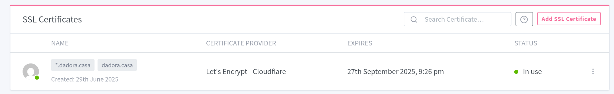
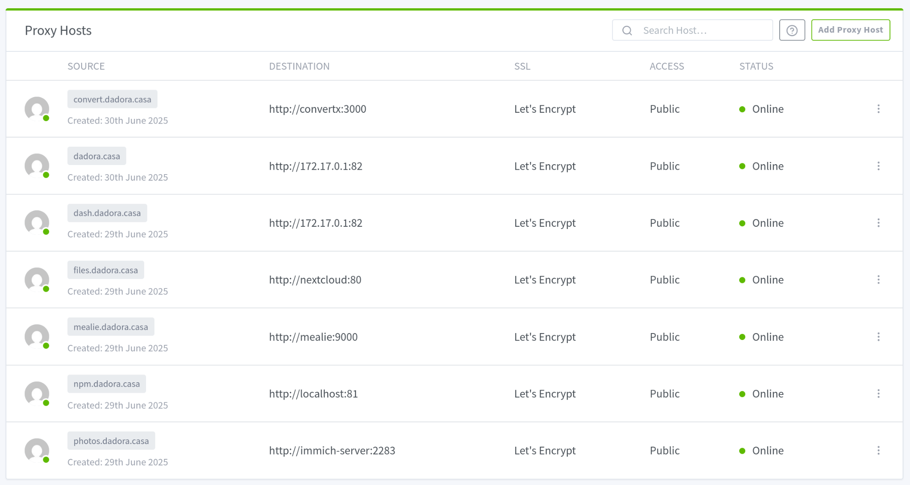

# Dora Setup

## Basic installation

Install Ubuntu Server 24.04. **Make sure to check the box to install OpenSSH during the OS installation**. Now reboot and login.

### Internet access

If you didn´t install the OS while connected to the internet, you might not have a connection already configured. If that's the case, first find out the name of your ethernet network interface.

```bash
ip address
```

Then create the `/etc/netplan/ethernet.yaml` file with the following configuration.

```yaml
network:
    version: 2
    renderer: networkd
    ethernets:
        <INTERFACE_NAME>:
            dhcp4: true
```

Finally, run the following command to apply the new configuration.

```bash
sudo netplan apply
```

Reboot and test your internet connection.

Now would also be a good moment to check if you can SSH into the server.

### Tools

Update the system and then reboot.

```bash
sudo apt update && sudo apt upgrade
```

Now install your preferred tools, here are a few suggestions.

```bash
sudo apt install \
    micro \
    fish \
    net-tools \
    ncdu
```

### External configuration

This would be a great time to check if the external services configuration is correct. Please check the [external configuration tutorial](./external-config.md) for more information.

## RAID

Install ZFS utils.

```bash
sudo apt install zfsutils-linux
```

### Create ZFS pool

Create the ZFS pool using the disks and configuration you want. This is an example that creates a pool named `dora-storage`  using RAID5 (raidz1) with four drives mapped to `/dev/sda`, `/dev/sdb`, `/dev/sdc` and `/dev/sdd`.

```bash
sudo zpool create dora-storage raidz1 /dev/sda /dev/sdb /dev/sdc /dev/sdd
```

Enable compression for the ZFS pool.

```bash
sudo zfs set compression=on dora-storage
```

You can check if it worked using the `get` command.

```bash
sudo zfs get compression dora-storage
```

### Export and import ZFS pool config

TODO: @pedro

### Useful commands

- Check the name of the devices for your drives: `lsblk -o NAME,SIZE,SERIAL,LABEL,FSTYPE`
- Check the ZFS pool status: `zpool status`
- List active pools: `zpool list`
- Enable or disable the ZFS pool: `sudo zpool <on|off>line dora-storage`

## Tailscale

Install tailscale and login into your account.

```bash
curl -fsSL https://tailscale.com/install.sh | sh
```

Use the default configuration, don't mess with DNS and that stuff.

### Useful commands

- Login to another account (interactivev): `sudo tailscale login`
- Enable tailscale: `sudo tailscale up`
- Disable tailscale: `sudo tailscale down`
- Change configuration: `sudo tailscale set ...`

## CasaOS

Install CasaOS using the standard installation method.

```bash
curl -fsSL https://get.casaos.io | sudo bash
```

Change the WebUI port to port 82.


### Configure Docker

Run these commands to add the user to the docker group

```bash
sudo groupadd docker
sudo usermod -aG docker $USER
newgrp docker
```

Now reboot.

Now, create the docker bridge network

```bash
sudo docker network create --label com.docker.compose.network=dora-network dora-network
```

### Import and export Dockerfiles

TODO: @pedro

## Nginx Proxy Manager

### SSL Certificates

Click `Add SSL Certificate` and then click `Let's Encrypt` and a form pop-up will appear. You'll need to fill these fields:

- Domain Names: `*.dadora.casa` and `dadora.casa`
- Email Address for Let's Encrypt: `doratrschneider@gmail.com`
- Toggle `Use a DNS Challenge` on
  - DNS Provider: Choose `Cloudflare`
  - Propagation settings: leave blank
- Agree to the Let's Encrypt Terms of Service
- Click `Save`

The final result should look like this:



### Hosts > Proxy Hosts

Click `Add Proxy Host` and a form pop-up will appear. You'll need to fill in the fields as follows:

- Under `Details`:
  - Domain Names: The domain name you want your application to have (e.g. `dash.dadora.casa`)
  - Scheme: `http`
  - Forward Hostname / IP: The hostnmae of the application you want to forward requests from. This will be the name of the Docker Container of the app
  - Forward Port: The port the aplication exposes on the Docker network
  - Leave the rest as is
- Under SSL:
  - SSL Certificate: Choose the one you created on the previous step
  - Enable `Force SSL`
  - Enable `HTTP/2 Support`
  - Leave the rest disabled
- You can ignore the rest of the settings
- Click Save

Repeat these steps for every application you have on the server. The final result should look like this:


