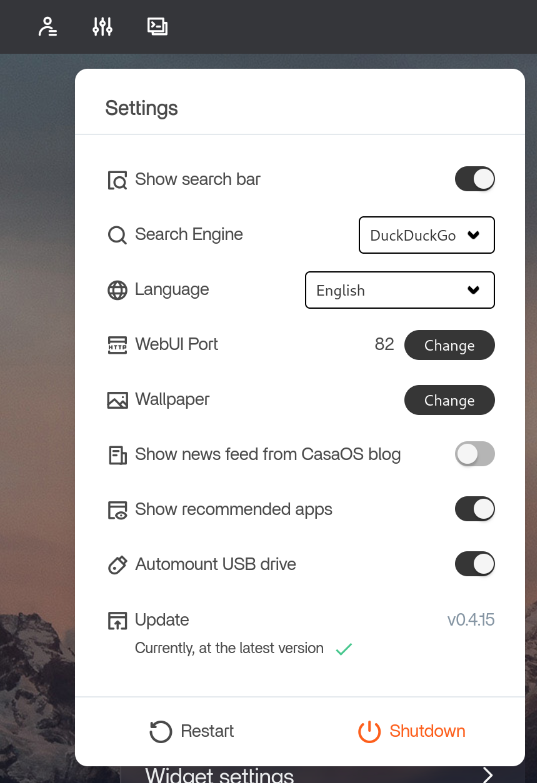

# Dora Setup

## Basic installation

Install Ubuntu Server 24.04. **Make sure to check the box to install OpenSSH during the OS installation**. Now reboot and login.

### Internet access

If you didn´t install the OS while connected to the internet, you might not have a connection already configured. If that's the case, first find out the name of your ethernet network interface.

```bash
ip address
```

Then create the `/etc/netplan/ethernet.yaml` file with the following configuration.

```yaml
network:
    version: 2
    renderer: networkd
    ethernets:
        <INTERFACE_NAME>:
            dhcp4: true
```

Finally, run the following command to apply the new configuration.

```bash
sudo netplan apply
```

Reboot and test your internet connection.

Now would also be a good moment to check if you can SSH into the server.

### Tools

Update the system and then reboot.

```bash
sudo apt update && sudo apt upgrade
```

Now install your preferred tools, here are a few suggestions.

```bash
sudo apt install \
    micro \
    fish \
    net-tools \
    ncdu
```

### External configuration

This would be a great time to check if the external services configuration is correct. Please check the [external configuration tutorial](./external-config.md) for more information.

## RAID

Install ZFS utils.

```bash
sudo apt install zfsutils-linux
```

### Create ZFS pool

Create the ZFS pool using the disks and configuration you want. This is an example that creates a pool named `dora-storage`  using RAID5 (raidz1) with four drives mapped to `/dev/sda`, `/dev/sdb`, `/dev/sdc` and `/dev/sdd`.

```bash
sudo zpool create dora-storage raidz1 /dev/sda /dev/sdb /dev/sdc /dev/sdd
```

Enable compression for the ZFS pool.

```bash
sudo zfs set compression=on dora-storage
```

You can check if it worked using the `get` command.

```bash
sudo zfs get compression dora-storage
```

### Export and import ZFS pool config

TODO: @pedro

### Useful commands

- Check the name of the devices for your drives: `lsblk -o NAME,SIZE,SERIAL,LABEL,FSTYPE`
- Check the ZFS pool status: `zpool status`
- List active pools: `zpool list`
- Enable or disable the ZFS pool: `sudo zpool <on|off>line dora-storage`

## Tailscale

Install tailscale and login into your account.

```bash
curl -fsSL https://tailscale.com/install.sh | sh
```

Use the default configuration, don't mess with DNS and that stuff.

### Useful commands

- Login to another account (interactivev): `sudo tailscale login`
- Enable tailscale: `sudo tailscale up`
- Disable tailscale: `sudo tailscale down`
- Change configuration: `sudo tailscale set ...`

## CasaOS

Install CasaOS using the standard installation method.

```bash
curl -fsSL https://get.casaos.io | sudo bash
```

Change the WebUI port to something other than 80, like 82.



Then, install all the apps that you want. The specific configuration for the applications currently being used can be found at the [applications folder](./applications)

## Caddy

Install `xcaddy`

```bash
sudo apt install xcaddy
```

TODO: pedro
Check caddy certificates, how to run, systemclt, caddy run, etc
Check root domain
