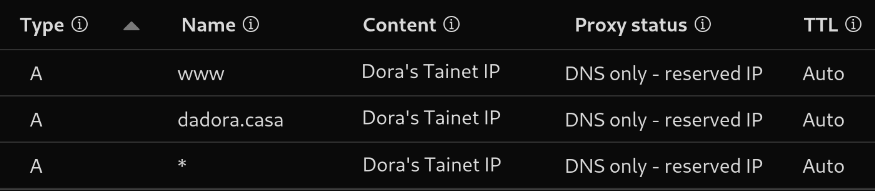
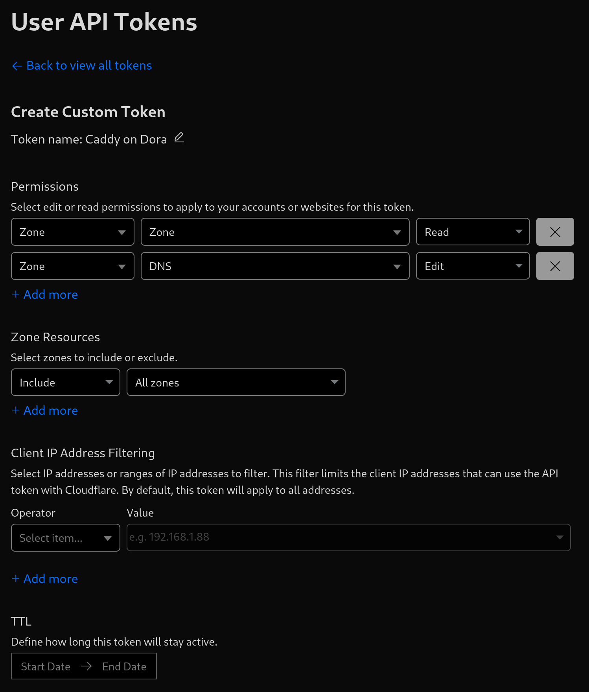

# External Configuration

## Tailscale

Leave everything default, don't try to mess with MagicDNS or similar, just use tailscale for VPN.

## Cloudflare

Buy domain and configure DNS records as following.

### API token

You will need to generate an API token to use with Caddy for TLS certificate issue. To do so, go to `Profile > API Tokens > Create Token > Create Custom Token`.

Use the following configuration for the API token.

